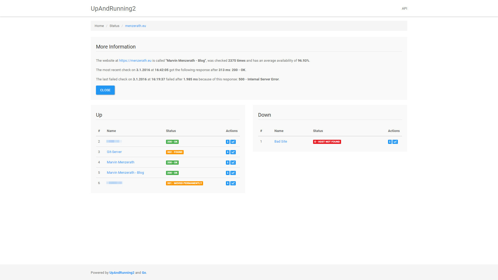
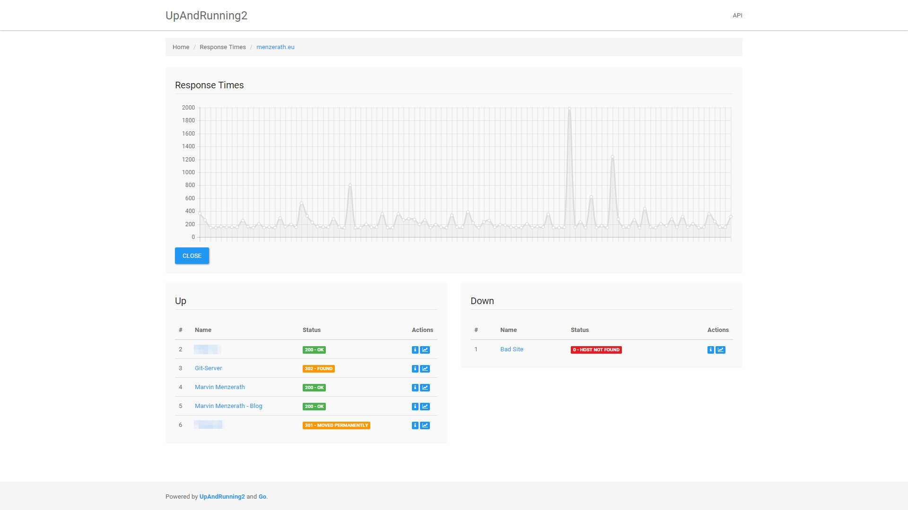
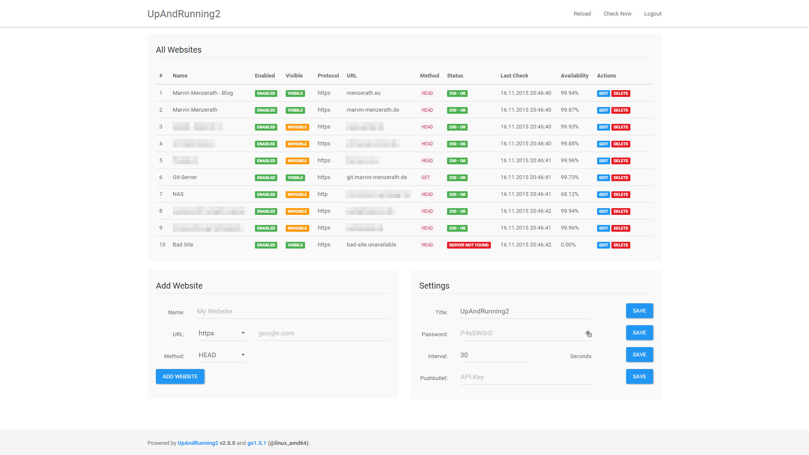
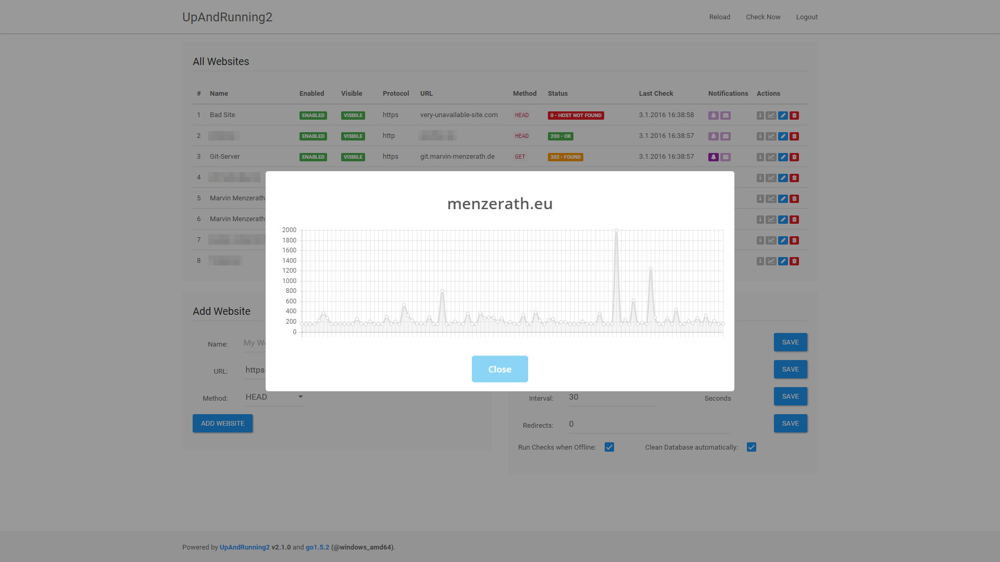
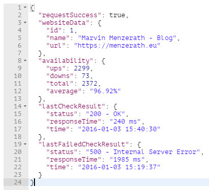

# UpAndRunning2
[](https://drone.io/github.com/MarvinMenzerath/UpAndRunning2/latest)
[](https://imagelayers.io/?images=marvinmenzerath/upandrunning2:latest)

UpAndRunning2 is a lightweight Go application which **monitors all of your websites**, offers a simple **JSON-REST-API** and user-defined **notifications**.

## Features
* Easy [Installation](#installation) and Configuration
	* Use a small Docker-image for quick and easy deployment
* Checks all of your websites regularly
	* Use `HEAD` or `GET` requests
	* Set an interval of 10 seconds up to 10 minutes
	* Set a maximum amount of redirects to follow
	* Detects nearly all HTTP-status-codes, timeouts and unknown hosts
	* Control whether the application checks without an internet-connection or not
* Simple, but powerful [JSON-REST-API](#api)
* Build your own client or use the fully-featured web-interface
* bcrypt ensures your password is stored safely
* Get notifications via
	* Email
	* Pushbullet

### Some Details on the Check-Algorithm
UpAndRunning2 checks the response it gets from a simple HTTP-HEAD-request to the specified url.  
This table shows how the different responses are handled:

| Response Code | Category |
|---------------|----------|
| 1xx           | OK       |
| 2xx           | OK       |
| 3xx           | Warning  |
| 4xx           | Error    |
| 5xx           | Error    |

Next to those HTTP status codes the application is also able to recognize a request timeout (allows a second check) or unknown hosts.

**Notice**: Some websites or applications may not respond correctly to a HEAD-request.  
In this case you need to adjust the used Check-Method to a GET-request.

## Installation
Looking for the Docker Guide? Click [here](docker/README.md).

* Download and extract all the files in a directory
* Prepare your MySQL-Server: create a new user and a new database
* Copy `config/default.json` to `config/local.json` and change this file to your needs
* Visit `http://localhost:8080/admin` and use `admin` to authenticate. You should change the password immediately.
* Done!

### Upgrading
When upgrading the application, you need to update to the latest release of your currently installed minor version (e.g. v2.0.2) before upgrading to the next minor or major version (e.g. v2.1).  
Otherwise you may loose access to your data and need to wipe your database.

Also make sure that your custom applications using UpAndRunning's API are up-to-date and are not using a deprecated API-version.

## API v1

### Just Text

#### Welcome Message
`GET` `/api`:  
```json
{
	"requestSuccess": true,
	"message": "Welcome to UpAndRunning2's API!"
}
```

#### Welcome Message
`GET` `/api/v1`:  
```json
{
	"requestSuccess": true,
	"message": "Welcome to UpAndRunning2's API v1!"
}
```

### Public Statistics

#### List of all (publicly available) Websites
`GET` `/api/v1/websites`:  
```json
{
	"requestSuccess": true,
	"websites": [
		{
			"name": "My Website",
			"protocol": "https",
			"url": "website.com",
			"status": "200 - OK"
		}
	]
}
```

If this API is accessed while being authenticated, the user will receive a slightly different response:  
`GET` `/api/v1/websites`:  
```json
{
	"requestSuccess": true,
	"websites": [
		{
			"id": 1,
			"name": "My Website",
			"enabled": true,
			"visible": true,
			"protocol": "https",
			"url": "website.com",
			"checkMethod": "HEAD",
			"status": "200 - OK",
			"time": "2015-01-01 00:00:00",
			"notifications": {
				"pushbullet": false,
				"email": true
			}
		}
	]
}
```

#### Current Status of a Website
`GET` `/api/v1/websites/:url/status`:  
```json
{
	"requestSuccess": true,
	"websiteData": {
		"id": 1,
		"name": "My Website",
		"url": "https://website.com"
	},
	"availability": {
		"ups": 99,
		"downs": 1,
		"total": 100,
		"average": "99.00%"
	},
	"lastCheckResult": {
		"status": "200 - OK",
		"responseTime": "150 ms",
		"time": "2015-01-01 00:00:00"
	},
	"lastFailedCheckResult": {
		"status": "500 - Internal Server Error",
		"responseTime": "0 ms",
		"time": "2014-12-31 20:15:00"
	}
}
```

#### Last Check-Results of a Website
`GET` `/api/v1/websites/:url/results`:  
```json
{
	"requestSuccess": true,
	"results": [
		{
			"status": "200 - OK",
            "responseTime": "150 ms",
            "time": "2015-01-01 00:00:00"
		}
	]
}
```
**Optional Parameters:**
* `?limit=100`
* `?offset=50`

### Actions
Notice: These APIs require authentication.

#### Trigger a Check
`GET` `/api/v1/check`:  
```json
{
	"requestSuccess": true,
	"message": ""
}
```

### Authentication

#### Login
`POST` `/api/v1/auth/login`:  
```json
{
	"requestSuccess": true,
	"message": ""
}
```
**Required Parameters:**
* `password`

#### Logout
`GET` `/api/v1/auth/logout`:  
```json
{
	"requestSuccess": true,
	"message": ""
}
```

### Settings
Notice: These APIs require authentication.

#### Application-Title
`PUT` `/api/v1/settings/title`:  
```json
{
	"requestSuccess": true,
	"message": ""
}
```
**Required Parameters:**
* `title`

#### Check-Interval
`PUT` `/api/v1/settings/interval`:  
```json
{
	"requestSuccess": true,
	"message": ""
}
```
**Required Parameters:**
* `interval` - `10 - 600`

#### Admin-Password
`PUT` `/api/v1/settings/password`:  
```json
{
	"requestSuccess": true,
	"message": ""
}
```
**Required Parameters:**
* `password`

#### Amount of Redirects
`PUT` `/api/v1/settings/redirects`:  
```json
{
	"requestSuccess": true,
	"message": ""
}
```
**Required Parameters:**
* `redirects` - `0 - 10`

#### Run Checks when Offline
`PUT` `/api/v1/settings/checkWhenOffline`:  
```json
{
	"requestSuccess": true,
	"message": ""
}
```
**Required Parameters:**
* `checkWhenOffline` - `true / false`

#### Automatic Database-Cleaning
`PUT` `/api/v1/settings/cleanDatabase`:  
```json
{
	"requestSuccess": true,
	"message": ""
}
```
**Required Parameters:**
* `cleanDatabase` - `true / false`

### Website Management
Notice: These APIs require authentication.

#### Add a Website
`POST` `/api/v1/admin/websites/:url`:  
```json
{
	"requestSuccess": true,
	"message": ""
}
```
**Required Parameters:**
* `name`
* `protocol`
* `checkMethod`

#### Update a Website
`PUT` `/api/v1/admin/websites/:url`:  
```json
{
	"requestSuccess": true,
	"message": ""
}
```
**Required Parameters:**
* `name`
* `protocol`
* `url`
* `checkMethod`

#### Delete a Website
`DELETE` `/api/v1/admin/websites/:url`:  
```json
{
	"requestSuccess": true,
	"message": ""
}
```

#### Enable / Disable a Website
`PUT` `/api/v1/admin/websites/:url/enabled`:  
```json
{
	"requestSuccess": true,
	"message": ""
}
```
**Required Parameters:**
* `enabled` - `true / false`

#### Set a Website's visibility
`PUT` `/api/v1/admin/websites/:url/visibility`:  
```json
{
	"requestSuccess": true,
	"message": ""
}
```
**Required Parameters:**
* `visible` - `true / false`

#### Get a Website's notification settings
`GET` `/api/v1/admin/websites/:url/notifications`:  
```
{
	"requestSuccess": true,
	"notifications": {
		"pushbulletKey": "abcdef123456",
		"email": "me@mymail.com"
	}
}
```

#### Set a Website's notification settings
`PUT` `/api/v1/admin/websites/:url/notifications`:  
```json
{
	"requestSuccess": true,
	"message": ""
}
```
**Required Parameters:**
* `pushbulletKey` - `"" to disable`
* `email` - `"" to disable`

## Screenshots







## Credits

### Used Software
* [Bootstrap](https://github.com/twbs/bootstrap)
	* [Bootswatch Theme: Paper](https://github.com/thomaspark/bootswatch)
	* [Bootstrap Notify](https://github.com/goodybag/bootstrap-notify)
* [Font Awesome](http://fontawesome.io)
* [jQuery](https://jquery.com)
	* [Chart.js](https://github.com/nnnick/Chart.js)
	* [SweetAlert](https://github.com/t4t5/sweetalert)
* Golang Libraries
	* [Go-MySQL-Driver](https://github.com/go-sql-driver/mysql)
	* [Golang logging library](https://github.com/op/go-logging)
	* [gomail](http://gopkg.in/gomail.v2)
	* [GoReq](https://github.com/franela/goreq)
	* [HttpRouter](https://github.com/julienschmidt/httprouter)
	* [pushbullet-go](https://github.com/mitsuse/pushbullet-go)

### Application Icon
[Icon](https://www.iconfinder.com/icons/328014/back_on_top_top_up_upload_icon) created by [Aha-Soft Team](http://www.aha-soft.com) - [CC BY 2.5 License](http://creativecommons.org/licenses/by/2.5/)

## License
The MIT License (MIT)

Copyright (c) 2015-2016 Marvin Menzerath

Permission is hereby granted, free of charge, to any person obtaining a copy of this software and associated documentation files (the "Software"), to deal in the Software without restriction, including without limitation the rights to use, copy, modify, merge, publish, distribute, sublicense, and/or sell copies of the Software, and to permit persons to whom the Software is furnished to do so, subject to the following conditions:

The above copyright notice and this permission notice shall be included in all copies or substantial portions of the Software.

THE SOFTWARE IS PROVIDED "AS IS", WITHOUT WARRANTY OF ANY KIND, EXPRESS OR IMPLIED, INCLUDING BUT NOT LIMITED TO THE WARRANTIES OF MERCHANTABILITY, FITNESS FOR A PARTICULAR PURPOSE AND NONINFRINGEMENT. IN NO EVENT SHALL THE AUTHORS OR COPYRIGHT HOLDERS BE LIABLE FOR ANY CLAIM, DAMAGES OR OTHER LIABILITY, WHETHER IN AN ACTION OF CONTRACT, TORT OR OTHERWISE, ARISING FROM, OUT OF OR IN CONNECTION WITH THE SOFTWARE OR THE USE OR OTHER DEALINGS IN THE SOFTWARE.
