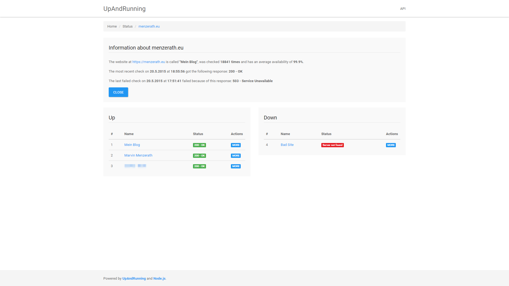
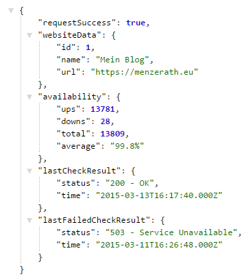
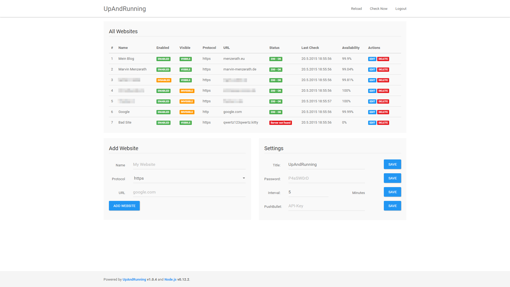

# UpAndRunning2 [](https://drone.io/github.com/MarvinMenzerath/UpAndRunning2/latest)
UpAndRunning2 is a lightweight Go application which monitors all of your websites for availability and offers a simple JSON-API.  
You can also enter your PushBullet-API-Key to get a Push each time the status of one of your websites changes.

## Installation
[](https://heroku.com/deploy?template=https://github.com/MarvinMenzerath/UpAndRunning2)  
Coming soon(ish)!

* Download and extract all the files in a directory
* Prepare your MySQL-Server: create a new user and a new database
* Copy `config/default.json` to `config/local.json` and change this file to your needs
* Visit `http://localhost:8080/admin` and use `admin` to authenticate. You should change the password immediately.
* Done!

### Upgrading from UpAndRunning
When upgrading from UpAndRunning (UpAndRunning1) you need to manually delete two rows from your database:
* `salt`@settings
* `password`@settings

You may use the following SQL-Query to remove those rows:
```sql
DELETE FROM settings WHERE name = 'salt';
DELETE FROM settings WHERE name = 'password';
```

## API

### User
Notice: Everyone is able to access those APIs.

#### Status
`/api/status/website.com`:

```json
{
	"requestSuccess": true,
	"websiteData": {
		"id": 1,
		"name": "My Website",
		"url": "https://website.com"
	},
	"availability": {
		"ups": 99,
		"downs": 1,
		"total": 100,
		"average": "99.00%"
	},
	"lastCheckResult": {
		"status": "200 - OK",
		"time": "2015-01-01T00:00:00.000Z"
	},
	"lastFailedCheckResult": {
		"status": "500 - Internal Server Error",
		"time": "2014-12-31T20:15:00.000Z"
	}
}
```

#### List
`/api/websites`:

```json
{
	"requestSuccess": true,
	"websites": [
		{
			"name": "My Website",
			"protocol": "https",
			"url": "website.com",
			"status": "200 - OK"
		}
	]
}
```

### Admin
Notice: You have to login before you are able to use those APIs.

#### List all Websites
`/api/admin/website/list`:

```json
{
	"requestSuccess": true,
	"websites": [
		{
			"id": 1,
			"name": "My Website",
			"enabled": true,
			"visible": true,
			"protocol": "https",
			"url": "website.com",
			"status": "200 - OK",
			"time": "2015-01-01T00:00:00.000Z",
			"avgAvail": "99.00%"
		}
	]
}
```

#### Add a Website
```
/api/admin/website/add
POST-parameters: name, protocol, url
```

#### Enable a Website
```
/api/admin/website/enable
POST-parameters: id
```

#### Disable a Website
```
/api/admin/website/disable
POST-parameters: id
```

#### Set a Website visible
```
/api/admin/website/visible
POST-parameters: id
```

#### Set a Website invisible
```
/api/admin/website/invisible
POST-parameters: id
```

#### Edit a Website
```
/api/admin/website/edit
POST-parameters: id, name, protocol, url
```

#### Delete a Website
```
/api/admin/website/delete
POST-parameters: id
```

#### Change Application-Title
```
/api/admin/settings/title
POST-parameters: title
```

#### Change Admin-Password
```
/api/admin/settings/password
POST-parameters: password
```

#### Change Check-Interval
```
/api/admin/settings/interval
POST-parameters: interval
```

#### Change PushBullet-API-Key
```
/api/admin/settings/pbkey
POST-parameters: key
```

#### Trigger a Check
```
/api/admin/check
POST-parameters: - none -
```

#### Login
```
/api/admin/login
POST-parameters: password
```

#### Logout
```
/api/admin/logout
POST-parameters: - none -
```

## Screenshots




## Credits

### Application Icon
[Icon](https://www.iconfinder.com/icons/328014/back_on_top_top_up_upload_icon) created by [Aha-Soft Team](http://www.aha-soft.com) - [CC BY 2.5 License](http://creativecommons.org/licenses/by/2.5/)

## License
The MIT License (MIT)

Copyright (c) 2015 Marvin Menzerath

Permission is hereby granted, free of charge, to any person obtaining a copy of this software and associated documentation files (the "Software"), to deal in the Software without restriction, including without limitation the rights to use, copy, modify, merge, publish, distribute, sublicense, and/or sell copies of the Software, and to permit persons to whom the Software is furnished to do so, subject to the following conditions:

The above copyright notice and this permission notice shall be included in all copies or substantial portions of the Software.

THE SOFTWARE IS PROVIDED "AS IS", WITHOUT WARRANTY OF ANY KIND, EXPRESS OR IMPLIED, INCLUDING BUT NOT LIMITED TO THE WARRANTIES OF MERCHANTABILITY, FITNESS FOR A PARTICULAR PURPOSE AND NONINFRINGEMENT. IN NO EVENT SHALL THE AUTHORS OR COPYRIGHT HOLDERS BE LIABLE FOR ANY CLAIM, DAMAGES OR OTHER LIABILITY, WHETHER IN AN ACTION OF CONTRACT, TORT OR OTHERWISE, ARISING FROM, OUT OF OR IN CONNECTION WITH THE SOFTWARE OR THE USE OR OTHER DEALINGS IN THE SOFTWARE.